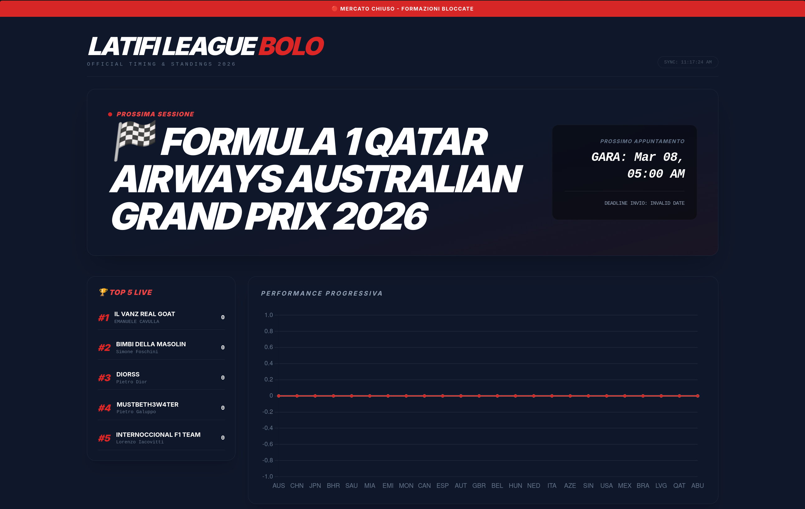

# 🏁 Latifi League Bolo - 2026 Dashboard

Benvenuti nella **Latifi League Bolo**, la dashboard ufficiale che traccia i disastri, i trionfi e i punti della nostra lega F1 2026. Sincronizzata in tempo reale con i calendari ufficiali e i dati di gara.

## 🛠️ Tech Stack & Architettura

Il progetto sfrutta un'architettura serverless basata su sincronizzazione asincrona dei dati per garantire aggiornamenti costanti senza intervento manuale.

### 🔌 Data Pipeline (The "Engine")
* **Google Sheets API (CSV Layer):** Database centrale. I dati dei team vengono esportati dinamicamente in formato CSV per il frontend.
* **Google Apps Script:** Motore di sincronizzazione automatica che interroga il calendario ufficiale F1 e popola la tabella `Schedule`.
* **F1 Official Calendar Sync:** Integrazione tramite ID Calendario per orari precisi di FP1, Qualifiche, Sprint e Race.

### 💻 Frontend (The "Aero")
* **Tailwind CSS:** Interfaccia "F1 Dark Mode" ultra-responsiva e moderna.
* **Chart.js:** Visualizzazione della performance progressiva dei team durante la stagione 2026.
* **Vanilla JavaScript (ES6+):** Logica di parsing multi-sheet e gestione dell'**Hero Dinamico** con calcolo della deadline basato sulle sessioni competitive (Quali/Sprint).

## 📊 Funzionalità Principali
* **Dynamic Race Hero:** Riconoscimento automatico del GP della settimana e della prossima sessione.
* **Smart Deadline System:** Blocco automatico del mercato 1 ora prima della prima sessione ufficiale (Qualifiche o Sprint).
* **Top 5 Live Ranking:** Sidebar dinamica che evidenzia i leader della lega.
* **Progressive Chart:** Grafico a linee per analizzare l'andamento del campionato.

## 🛠️ Come aggiornare i dati
1. Modifica i punteggi nel foglio **"Export Sito"** su Google Sheets.
2. Il sito si aggiornerà automaticamente al prossimo refresh grazie alla pipeline CSV.
3. Lo schedule delle gare è gestito autonomamente dal trigger di Google Apps Script.

---
*Creato da Ghigo - Studente di Ingegneria @ Bologna*